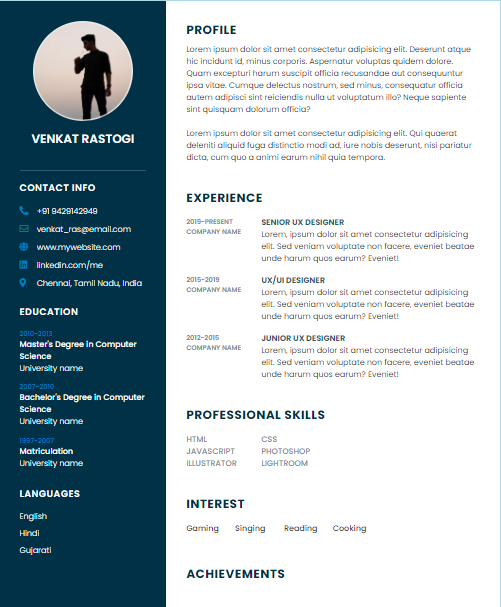
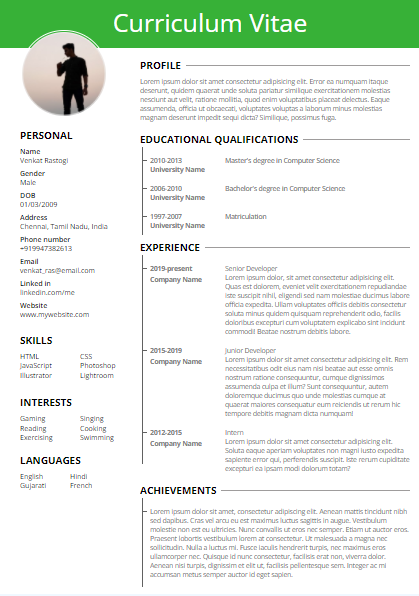
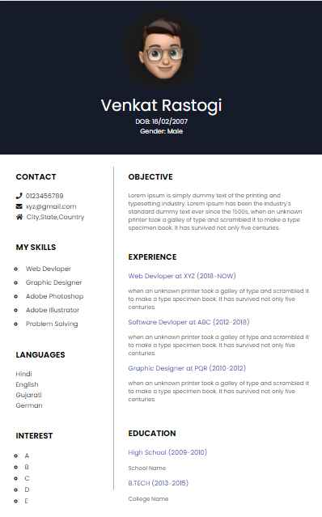

# Resume Builder

A modern, browser-based Resume Builder web application that allows users to quickly create, customize, preview, and export professional resumes. Built entirely with standard client-side web technologies, all resume draft data is kept private and stored locally in the user's browser using `localStorage` without requiring a backend server, user authentication, or database setup.

---

## Live Demo

Experience the live application hosted on GitHub Pages:
👉 [Resume Builder Live Demo](https://v-jasvanth.github.io/Resume-builder/)

---

## Project Preview

| Stanford Template | Harvard Template | Edinburgh Template |
| :---: | :---: | :---: |
|  |  |  |

---

## How It Works

1. **Enter Personal Details**: Fill in your contact information, profile photo, and an optional custom resume title.
2. **Add Experience & Background**: Add your educational qualifications, work history, skills, hobbies, languages, and achievements using responsive, dynamic forms.
3. **Select Template & Palette**: Choose from three resume layouts (Stanford, Harvard, Edinburgh) and customize header/sidebar color swatches.
4. **Preview & Export**: Instantly preview your formatted resume and export it as an A4 PDF document (`window.print()`) or download it as a PNG image (`HTML5 Canvas`).

---

## Key Features

- **Multi-Step Form Interface**: Guided form navigation for Personal Details, Experience, and Template Selection.
- **Comprehensive Resume Content Sections**:
  - Personal Information & Custom Resume Header
  - Educational Background & Qualifications
  - Work Experience & Employment History
  - Skills & Core Competencies
  - Hobbies & Personal Interests
  - Languages Spoken & Proficiency
  - Key Achievements & Profile Summary
- **Profile Photo Upload**: Real-time profile photo preview with client-side format validation (JPG, JPEG, PNG, GIF, WEBP) and 3 MB size limit.
- **Automatic Draft Persistence**: Continuous `localStorage` auto-saving as you type, preserving work across browser reloads.
- **Start Fresh / Clear Form**: One-click control to reset form fields and delete saved draft data after user confirmation.
- **Multiple Professional Templates**:
  - **Stanford (Template 1)**: Sleek two-column layout with bold sidebar header accents and structured section boxes.
  - **Harvard (Template 2)**: Classic single/double header layout with prominent title header, circular avatar, and clean horizontal dividers.
  - **Edinburgh (Template 3)**: Modern dark header theme with side-by-side contact details, skill lists, and timeline experiences.
- **Dynamic Color Customization**: Live palette swatches for selecting custom header and sidebar accent colors across all templates.
- **Flexible Export Options**:
  - **Print / Save as PDF**: Optimized `@media print` CSS rules for A4 page dimensions, hiding all UI controls, buttons, and navigation elements.
  - **PNG Image Export**: High-resolution image export using native HTML5 Canvas Blob generation.
- **Form Validation & Real-time Feedback**: Descriptive inline validation error messages for required fields, email format, phone numbers, and URLs.
- **Security & Privacy**: Client-side XSS protection with HTML escaping, no external API keys required, offline location fallback dropdowns (Country, State, City), and 100% local storage.
- **Responsive Layout**: Fluid design optimized for desktop, tablet, and mobile screens (320px to 1200px+).

---

## Templates Overview

1. **Stanford (Template 1)**: Ideal for corporate, tech, and engineering roles requiring a clear separation between core contact details/skills and detailed employment history.
2. **Harvard (Template 2)**: Ideal for academic, research, management, and executive applications featuring a traditional structured layout and prominent custom header.
3. **Edinburgh (Template 3)**: Ideal for creative, design, marketing, and modern professional roles using a dark header theme and visual progress bars.

---

## Technology Stack

- **Core**: HTML5, CSS3, JavaScript (ES6)
- **Libraries**: jQuery, Bootstrap 4/5, FontAwesome, Bootstrap Icons
- **APIs & Storage**: Browser `localStorage`, HTML5 Canvas API (`toBlob`), FileReader API

---

## Project Structure

```text
Resume-Builder/
├── index.html              # Homepage & template showcase
├── Form.html               # Multi-step resume builder application
├── faq.html                # Frequently Asked Questions page
├── form.js                 # Form handling, validation, auto-save engine
├── transfer.js             # Input sanitization and template rendering
├── README.md               # Project documentation
├── .gitignore              # Git exclusion rules
├── css/
│   ├── index.css           # Homepage styling
│   ├── form.css            # Resume builder form & print styles
│   └── faq.css             # FAQ page styling
├── Templates/
│   ├── template1.css       # Stanford template styles
│   ├── template1.js        # Stanford template scripts
│   ├── template2.css       # Harvard template styles
│   ├── template2.js        # Harvard template scripts
│   └── template3.css       # Edinburgh template styles
└── images/                 # SVG logos, assets, and template previews
```

---

## How to Run Locally

Because this is a pure client-side web application, no server installation or build steps (`npm install` or `npm start`) are required.

1. **Clone the Repository**:
   ```bash
   git clone https://github.com/V-Jasvanth/Resume-builder.git
   ```
2. **Open the Project Folder** in VS Code or your preferred text editor.
3. **Launch the Application**:
   - Double-click `index.html` to open it directly in any modern web browser.
   - Alternatively, right-click `index.html` in VS Code and select **Open with Live Server**.

---

## Deployment Information

This application is static and ready for instant deployment on static hosting platforms such as:
- **GitHub Pages**
- **Netlify**
- **Vercel**

Since `index.html` is located at the root directory and all assets use clean relative paths, deploying requires simply pointing your static web host to the `main` branch.

---

## Privacy & Security

All resume data entered into the application remains on your local device. The application reads and writes draft states directly to your browser's `localStorage` and processes images locally via the `FileReader` API. No personal data, email addresses, or uploaded documents are transmitted to remote servers.
